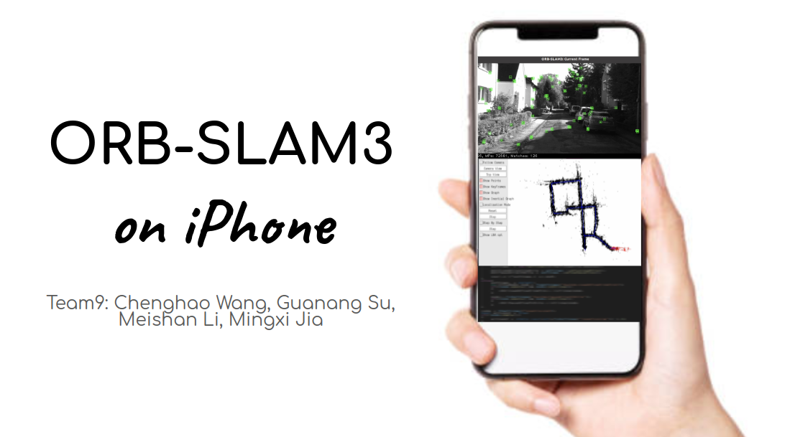

# ORBSLAM3 on iPhone
## Final project for EECE5554 @Northeastern University
## Team9: Chenghao Wang, Guanang Su, Meishan Li, Mingxi Jia

In order to run our method, you should install ORBSLAM3 [(installation)](https://github.com/SaulBatman/ORB_SLAM3) and Droidcam[(installation)](https://github.com/dev47apps/droidcam) on your UBUNTU PC. And, you should install droidcam in your iPhone, which you can find in App store.

ORBSLAM3 and droidcam repositories have already been forked into our github repo. Please refer to the installation links mentioned above to download these necessary components. It is highly recommended to check the official github repo. We also get a modified version monoVO-Python [here](https://github.com/SaulBatman/monoVO-python) as our baseline, where we also add out kitti toolkits. 

Our project is ORBSLAM3 on iPhone. The motivation is that SLAM often requires cameras like realsense, which is hard to get in daily life. So, why not use the camera in our iPhone? By using iPhone, many interesting applications can be furtherly extended, such as augmented reality, indoor localization, etc.

For now, the ORBSLAM algorithm runs on PC and the video sequence is transmitting from iPhone to PC via droidcam.

## Installation
1. Install ORBSLAM3 and its dependencies
Please follow the installation guidance [here](https://github.com/SaulBatman/ORB_SLAM3).

2. Install streaming tools
  * On iPhone / Android
  Install Droidcam from app store.
  * On Ubuntu PC
  Install Droidcam client follow [this](https://github.com/dev47apps/droidcam).

3. Install ROS driver for steaming
  On your Ubuntu PC, follow [this](https://github.com/ros-drivers/video_stream_opencv). Modify the publisher name from /web_cam/image_raw to /usb_cam/image_raw

4. Run ORBSLAM3 real-time with you smartphone!
  1. Start a roscore! Please ensure your PC and iPhone is connected with the same WIFI router.
  2. Use "droidcam YOUR_IP YOUR_PORT", ip and port can be found on Droidcam app on your phone.
  3. Use "rosrun ORB_SLAM3 Mono Vocabulary/ORBvoc.txt Example/Monocular?iPhone.yaml" in your terminal!

## On-device ORBSLAM3
If you would like to try the on-device ORBSLAM3, please refer to this [link](https://drive.google.com/drive/folders/1K5SzPNkahGHBhbs4ry2Aajzvn2mHcwQI?usp=sharing).

We complied this project by using Xcode 13.3.1, on the device runs IOS 15.3.

Note that the following dependencies were modified for better adaptation to IOS. -- Opencv2 libg2o libjpeg.

Note that this project have achieved the feature detection in realtime but the viewer is not yet complete.

## KITTI toolkit
* **User guide**: 

  Out toolkit allows you to convert any video sequences with self-defined sampling rate and image size, into KITTI formats, which includes a folder named image_0 and a timeStamp.txt.

  The detailed user guide is listed in my_data folder.

## Calibration toolkit
* **User guide**: 

  We also provide a calibration tool based on MATLAB. You can resize image and calibration your iPhone using the script.

## Achievements
* A overall review of ORBSLAM2 and ORBSLAM3! Learn about graph optimization and bundle adjustment.
* Test several webcam apps like Droidcam, iVCam, and Iriun Webcam. Droidcam is the most feasible one.
* Test ios viewer on Xcode. We can take picture using our own compiled app!
* Build a streaming layer between iPhone and PC via Droidcam
* We can streaming real-time video frames!
* Add a ROS driver for loading frame
* Our ORBSLAM3 on iPhone (real-time streaming version) is ready-to-go!
* Implement the ORB feature detector fully on iPhone!

## Weekly meetings
* April 25, 2022: Our final meeting! Everyone attends!
* April 24, 2022: Discussion about presentation!
* April 22, 2022: Discuss about experiments!
* April 20, 2022: Collect night and parking lot dataset.
* April 19, 2022: After-class meeting!
* April 18, 2022: Collect gaming dataset.
* April 12, 2022: After-class meeting! Indoor experiments.
* April 08, 2022: After-class meeting! Outdoor data collection.
